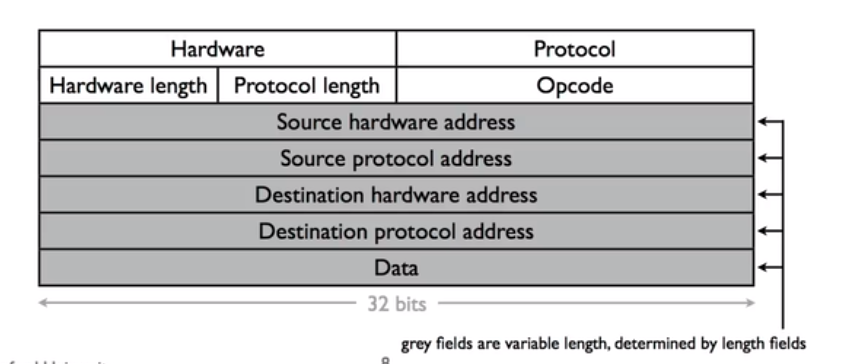

# Address Resolution Protocol(ARP)地址解析协议

## 定义
根据 IP地址(network layer) 查询 物理地址 (link layer)
是网络层可以使用的机制

IP address : network layer
Link address: 48位以太网地址

gateway 有多个接口，每个接口都有自己的link layer address以识别卡，也有多个network layer以识别该卡所属的网络的host的哪一部分

## example

- A 查看 netmask 子网掩码，发现 AB 不在同一网络下。
- A 给网关发个数据包:
  - network: A 和 B 的 IP 地址
  - link: A 和 左 gateway 的链路层地址
- 网关给B发数据包：
  - network: *A 和 B* 的 IP 地址
  - link: 右 gateway 和 B 的链路层地址

## 要点

- 生成 layer 2 和 layer 3 地址之间的映射
  - 节点(Nodes)缓存映射(mappings)，缓存条目过期 (Nodes cache mappings,cache entries expire )
    - 节点只对对他们自己的 requests 做出 respond,这意味着建立对其他 Nodes 的 mappings 的唯一方法是：根据其他的 Nodes 的 response 返回的 packet 来建立。
    - nodes 如果失去连接，会随着缓存条目的过期(不同机器的时间不同)离开这个网络。 

- 简单的 request-replay 协议
  - “谁有网络地址X?” 
  - "我有网络地址X "
- request 发送到链路层广播地址 (每个节点都会受到这个request)
- replay 发送到请求地址(不广播)
- 数据包格式包含冗余数据
  - request 有足够的信息来生成映射
  - 使 debug 更加简单
- 没有状态的“sharing”:bad state will die eventually

## ARP Packet Format (RFC826)

- hardware: 这个 request 或 response 是给哪个 link layer 的
- Protocol: 这个 request 或 response 是给哪个 network protocol（网络协议） 的
- opcode: 这个 packet 是 request 还是 response
- 四个地址用于 request and specify(指定) the mappings
  - 都是 big endian
  

## 拓展
[利用wireshark抓取arp](https://blog.csdn.net/u010442328/article/details/45419019)