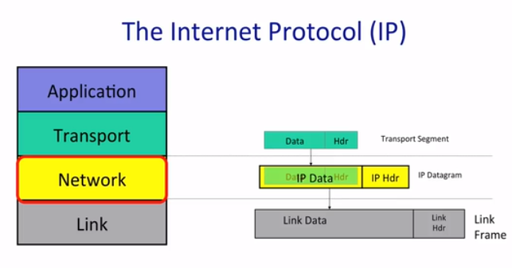

## IP

## 四个属性

- Datagram
  - 端对端传输数据
  - 数据报是独立的
- Unreliable
  - 数据包可能丢失
- Best effort
  - 但只会尽力而为
  - 拥塞
  - 不会告诉源：数据包丢失了
- Connectionless
  - 不维护每个流的状态
  - 未排序的

## 类比
IP中的数据：信件内的东西
IP中目标IP和发送IP: 带有目的地的信
IP包可能会丢失：邮政服务不会保证一定送达

## 为什么IP那么简单
- 使其简单、无脑、更小： 速度更快、效率更高、建造和维护成本更低
- 端对端原则：尽量在终端实现特性
- 允许在顶层建立可靠或者不可靠的服务
- 可以在任何 link 层使用：IP 对 link 层的假设很少

## 细节
- 避免 package 永远在里面循环
  - TTL(time to live 生存时间)
- IP 给长度过长的 package 分割
  - 链路层对数据包大小有限制： 以太网只能携带小于 1500 Bytes 的数据包
  - 提供了 标识 以帮助 router 重新组合
- 使用 header checksum(首部检验和) 来减少把 datagram 传递给错误目的地的机会
- 允许使用最新版的 IP
  - 现在的 IPv4 32bit address
  - IPv6 128bit address
- 允许给 header 添加 new options

## Summary 
- 我们发送接收 datagram 时每次都用到 ip
- IP 提供了有意的简单服务
  - Datagram
  - Unreliable
  - Best-effort
  - Connectionless