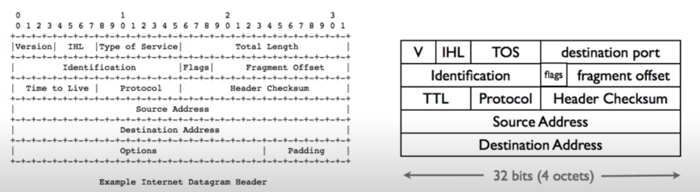
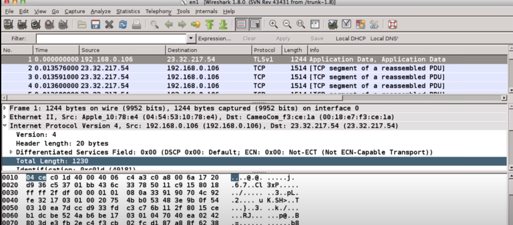

#  Byte order and packet formats

## 什么是大端/小端字节序
[理解字节序/作者：金晨](https://zhuanlan.zhihu.com/p/24487561?utm_source=qq&utm_medium=social&utm_oi=778991333737009152)


大端字节序：高位字节在前，低位字节在后，这是人类读写数值的方法。

小端字节序：低位字节在前，高位字节在后。

举例来说，数值0x22 11使用两个字节储存：高位字节是0x22，低位字节是0x11。

十进制：53 （16bits）   
大端字节序：0x00 35  
小端字节序：0x35 00


十进制：20 （16bits）   
大端字节序：0x00 14   
小端字节序：0x14 00

十进制：305414945 （32bits）  
大端字节序：0x12 34 43 21  
小端字节序：0x21 43 34 12  


计算机电路先处理低位字节，效率比较高，因为计算都是从低位开始的。所以，计算机的内部处理都是小端字节序。


人类还是习惯读写大端字节序。所以，除了计算机的内部处理，其他的场合几乎都是大端字节序，比如网络传输和文件储存。

"只有读取的时候，才必须区分字节序，其他情况都不用考虑。"

- 不同的处理器有不同的 endianness
  - 小字节序：x86；大字节序ARM(iphone)
  

## Network Byte Order

Network Byte Order is big endian.


文本数据在内存中的layout与字节顺序无关，在big endian和little endian的机器上显示结果相同

## Portable Code

网络编程时需要将network order转为host order

```c
uint16_t http_port = 80; //Host Order
if (packet->port == host_port) { //Network vs. host order
    ...
}
```
帮助函数：
```htons(),ntohs(),htonl(),ntohl()```  
```htons()```：host to network short 表示将16位的主机字节顺序转化为网络字节顺序  
```htonl()```：host to network long 表示将32位的主机字节顺序转化为网络字节顺序

```ntohs()```: network to host short  
```ntohl()```: network to host long  

```c
#include <arpa/inet.h>
uint_16_t http_port = 80;
uint_16_t packet_port = ntohs(packet->port);  //ntohs()是一个函数名，作用是将一个16位数由网络字节顺序转换为主机字节顺序
if (packet_port == http_port) { //OK
    ...
}
```

## packet formats



IPv4的total length 是 16 bits，总长度指首部和数据之和的长度，单位为字节。总长度字段为16位，因此package的最大长度为2^16-1=65535字节。


看出对应的 Total Length : 1230
在packet 里是 04 ce。
大端字节序。
