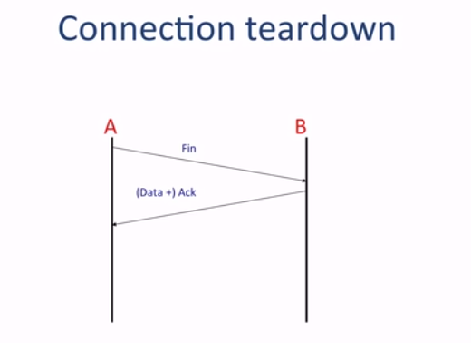
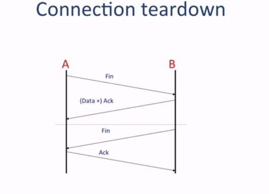
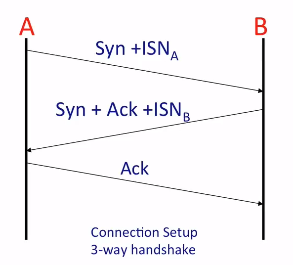

# The TCP Service Model

Application byte steam 交给 TCP 段

## 建立连接：三次握手

## 关闭连接：四次挥手   

- A to B 的 data stream 关闭了
- B 可能还有信息未发送，因此 B to A 的 data stream 未关闭
  

- B to A 的 data stream 关闭
- 此时 A B 间的连接都关闭了，可认为 AB 的连接状态关闭

## The TCP Service Model
- 字节流
  - 可靠的字节传输服务
- 可靠的传输
  - Acknowledgments 表示传递成功
  - Checksums（校验和） 检测破损S的数据 （corrupted data）
  - Sequence numbers（序列号） 检测 missing data
  - Flow- control(流量控制) 避免overrunning receiver(发送超速，发送方的发送速率过快导致接收方来不及处理)
    - 接受方发送缓存区的大小
- In-sequence(依次)
  - 按顺序传送给应用程序的数据。
  - TCP 使用序列号排序
- Congestion(拥塞) Control
  - 给所有用 TCP 连接平均分配网络容量
  - 很复杂，在第四单元详细讲

## The TCP Segment Format

- 比 IP 和 以太网 的复杂很多
  - 因为要保障可靠
- 目标端口 
  - 传递给哪个 application
    - Web: port 80
    - ssh :22
    - smtp(simple mail transport portocol): 23
- 源头端口
  - 告诉对方要传递给哪个端口
- 序列号
  - 字节流的第一个字节在字节流的位置
- Acknowledgment Sequence: 告诉另一端我们期待哪个字节
  - 我发送的 751 表示我上一个上收到的是 750
- 16 位校验和就算标头和数据的大小，用于检测数据包是否损坏
- 标头长度： 告诉 header 多长
- 一系列 flags   
  - ACK：Acknowledgment Sequence 有效
  - SYN 正在发送同步信号，是三步握手的一部分
  - FIN 一个方向的关闭连接
  - PSH 告诉另一端的 TCP 立即传输数据

## TCP 连接的 Unique ID
- TCP 连接由 TCP 和 IP 标头中的 5 个内容定义
  - 定义 end points
    - IP source address
    - IP destination address
  - 定义连接是 TCP 连接
    - IP Protocol ID for TCP
  - 定义 end points 的 application
    - TCP source ports
    -  TCP destination ports
-  A（initiator of the connection) picks a unique source port ID.
  - 必须确保它不会意外地选择与主机 B 上同一服务的另一个连接已经使用的相同源端口号( it is already using with another connection to the same service on Host B.)。
    - 它(increments)增加每个新连接的源端口号。
    - 大量 TCP 连接仍由可能相同 ID
      - 用随机的序列数字（ISN initial sequence number）初始化 TCP 连接

## TCP: Port Demultiplexing (端口多路分解) 

 

## TCP Sliding Window

- Window-based flow control 
  - to stop us from overwhelming the receiver
- Retransmission and timeouts
- Congesting control

## Summary
- TCP在应用程序进程之间提供顺序的、可靠的字节流传递。(TCP provides in-order,reliable delivery of a stream of bytes between application processes.)

 