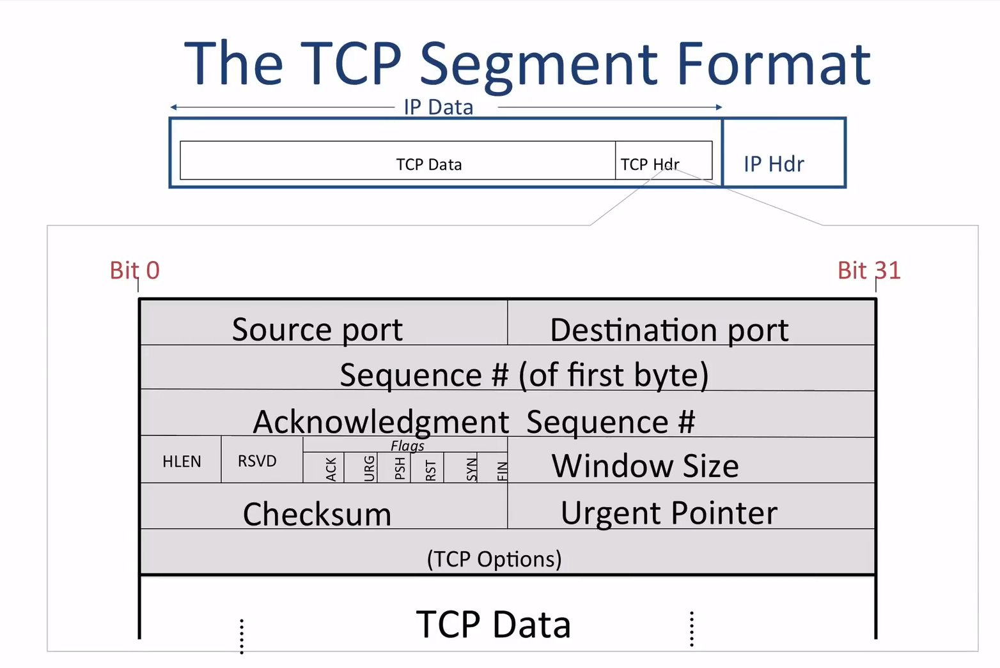

## TCP Header

- [理解TCP序列号（Sequence Number）和确认号（Acknowledgment Number）
](http://www.360doc.com/content/17/0116/11/33093582_622790286.shtml)

- [TCP 头](https://www.cnblogs.com/liquan2005/p/9113369.html)

- 20 Bytes long
- U: urgent
- P: push --push 给 application
- A: ack 如果 acknowledge number 是 valid 则为 1，发起连接前是 0
- R: reset
- S: syn 起始 sequence number，请同步到这个号码
- F: fin
- offset: 偏移，这是因为TCP 可能 options 
 ### Q1
 - sequence number: 4000
 - data size = 500 

sequence number:4000 ~ 4499
发送一个 Seq = 4000, Ack = 4500 的 TCP Packet

