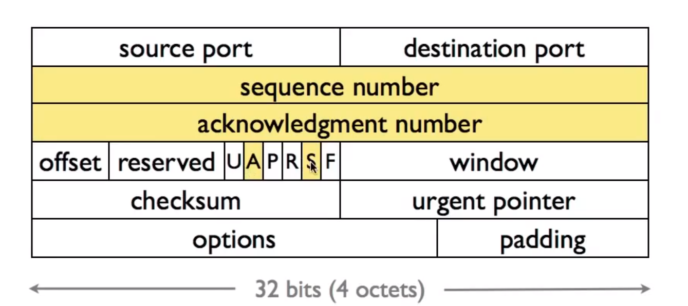
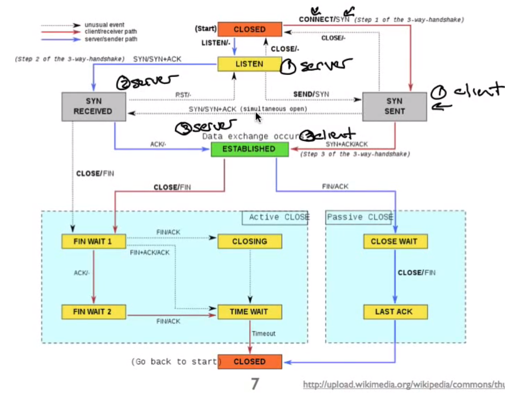

# TCP Setup and Teardown
3-way handshake(3步握手), simultaneous open(同步打开), and the TCP state machine(TCP状态机)

## 问题
- 可靠通信通常受益于连接两端拥有的某种状态
- 连接建立
  - 如何设置此状态?
- 连接关闭
  - 如何清理(重用端口等) 

## Connection Setup
用到的东西：


- [三次握手](https://www.cnblogs.com/aknife/p/10988099.html)
- [TCP 三次握手 四次挥手的序列号变化
](https://www.jianshu.com/p/16ef22e3a123)

### wireshark
Filter : ```tcp.port == 80 and ip.addr == XXX.XXX.XXX.XXX```

## Connection Teardown

- 两边都得发送 FIN
- FIN 表示没有更多需要传递的数据
- 关闭下的交换：
  - A->B
  - B->A
  - B->A
  - A->B
- Can also have simultaneous(同步) close
- Can A and B forget about closed socket after final message?


Problems with closed socket What if final ack is lost in the network?
What if the same port pair is immediately reused for a new connection?
## Cleaning Up safely
- Problems with closed socket
  - 如果fin ack在网络中丢失了怎么办?
    - 如果第二步 closed 的时候 ack 丢失就直接关闭，对方永远不会知道连接是否已经关闭
  - 如果 the same port pair 立即被重新用于一个新连接，会发生什么情况?
    - corrupt the data because sequence number of spaces overlap(重叠)
- 解决方法： “active” closer 走向 TIME WAIT
  - Active close is sending fin before receiving one.
  - Keep socket around for 2MSL (twice the"maximum segment lifetime")
- 会对 severs 造成问题
  - OS 有很多 sockets 在 TIME WAIT,slow things down
  - 黑客: Can send RST and delete socket, set SO_LINGER socket option to time 0 
  - OS 不会让你重新启动服务器，因为端口仍然在使用(So_REUSEADDR options让你重新绑定使用的端口号)
## 完整的TCP FSM

