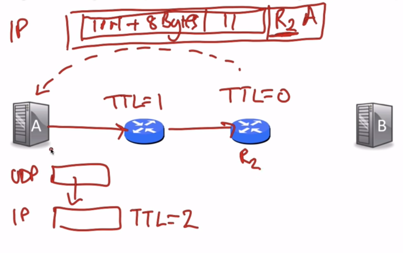

# ICMP(Internet Control Message Protocol 互联网报文控制协议)

负责报告错误、诊断网络层问题。
ICMP 工作在 Network Layer 之上

## 网络层工作
1. IP
   - 生成 IP 数据报
   - 端对端逐段跳跃
2. 路由表
   - 填充路由器转发表的算法
3. ICMP
   - 在 end hosts 和 routers 之间传递 network layer 信息
   - 报告 error 情况
   - 帮助我们诊断问题

## The ICMP Service Model
- 报告信息
  - 自包含的消息报告错误
- 无状态
  - 简单的 datagram service

## 一些 IMCP Message Types(RFC 792)
| ICMP Type| ICMP Code| Description|
|:---:|:---:|:---:|
|0|0|Echo Reply(used by ping)|
|3|0|目标 Network 无法到达|
|3|1|目标 Host 无法到达|
|3|3|目标 Port 无法到达|
|8|0|Echo Request(used by ping)|
|11|0|TTL 过期(used by traceroute)|

## ping 是怎么使用 ICMP 的
- 直接调用 ICMP Echo Request

- 目标返回 ICMP Echo Reply

## traceroute 是怎么使用 ICMP 的
- TTL 设置为 1,2,3....
- TTL 过期返回一个 ICMP
- UDP 中设置了一个无法被访问的 port,最后 B 会返回一个 目标 Port 无法到达

## Summary
- ICMP 提供信息关于 network layer to end hosts and routers
- 它位于ip之上，因此严格来说是一个传输层机制
- 常用的工具 "ping" 和 "traceroute" 都依赖于 ICMP
