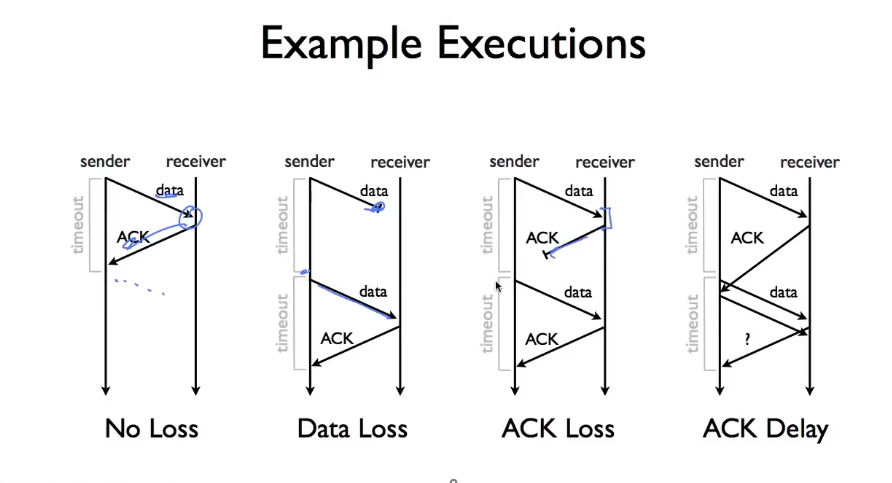

# Flow Control

- stop-and-wait 协议
- Sliding window

- 最后一种情况，最后一个 ark 不知道返回的是 重传的 data，还是新的 data。
- 解决方法： 计数器
  - 使用 1-bit 的计数器可以方便是新数据还是 duplicate
  - 两个假设
    - 网络本身不复制数据包
    - packets 不会有多个延迟

