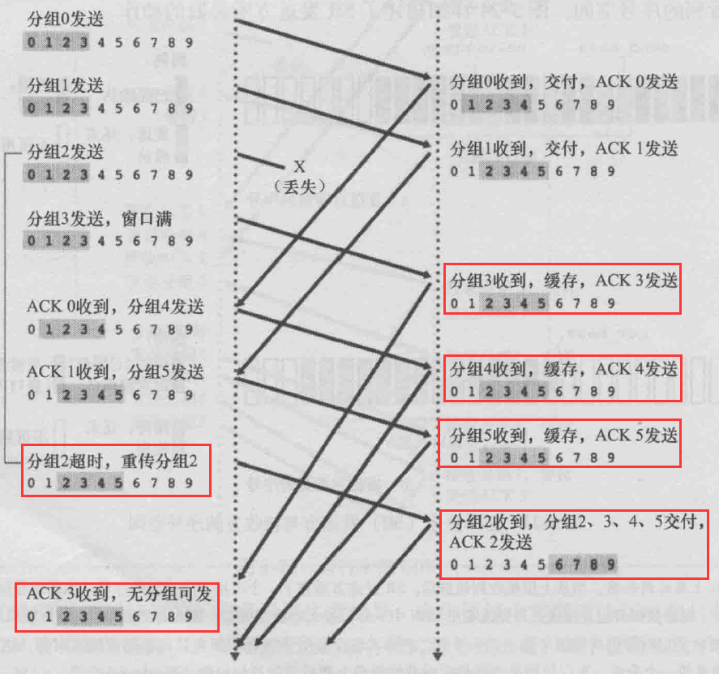

# Sliding window

## Stop and wait 的缺陷
带宽利用效率低

## Sliding window
- 广义的 stop and wait: 允许多个 un-acked segments。
- Bound on number of un-acked segments, 称为窗口
- Can keep pipe full（能保持管道满载）

## sliding Window VS Stop And Wait

## sliding windows sender（发送方）
- 每个 segment 都有一个序列号(seqNo)
- 维护三个变量
  - Send windows size(SWS)
  - Last acknowledgment recivied (LAR)
  - Last segment sent(LSS)
- 维护一个变量关系
  - (LSS - LAR) <= SWS 
  - 即 LSS <= LAR + SWS
  - 如果中间有丢失， LSS 则没法推进
- Advance(推进) LAR on new acknowledgment
- Buffer(缓存) up to SWS segments 

## sliding windows receiver（接收方）
- 维护三个变量
  - Receive windows size(RWS) 接收的 windows size
  - Last acceptable segment (LAS)最后一个可接收的 segment
  - Last segment received(LSR) 最后一个接收的 segment
- 维护一个变量关系
  - (LAS - LSR) <= RWS 
  - 即 LAS <= LSR + RWS
- 如果接受的 packet < LAS,则发送 acknowledge，如果不是会直接丢掉
  - 发送 cumulative(累计) acks: 如果接收 1,2,3,5，acknowledge 3 (TCP acks 是下一个期待的数据，因此发送的是 ack 4)

## RWS,SWS,and Sequence Space
- RWS >= 1, SWS >= 1, RWS <= SWS
- 如果 RWS = 1, "go back N"协议, 需要 SWS + 1 sequence numbers

- 如果 RWS = SWS ，需要 2SWS sequence numbers
- 通常需要 RWS + SWS sequence numbers
  - RWS packet 在一个未知的状态 (ACK may/may not be lost)
  - SWS packets in flight(飞行) must not overflow sequence number space(不能溢出序列号空间)

[SR 简书](https://www.jianshu.com/p/da00beae942e)  
[滑动窗口协议的窗口大小](https://blog.csdn.net/mr_j0304/article/details/89599086)

## TCP Flow Control
- Receiver advertises(通知) RWS using window field
- Sender 只能将数据发送到 LAR + window

