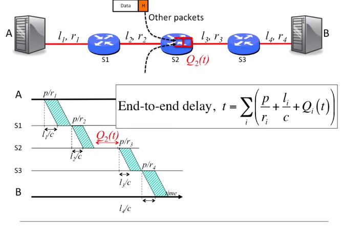
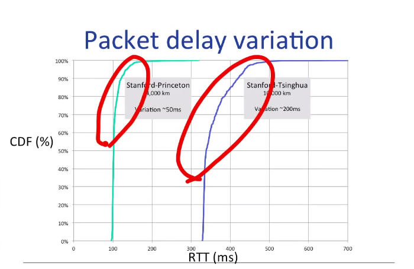

# End-to-end delay and Queueing delay

## Define
- propagation(传播)延迟 
  - t1 = l/c (c 接近光速，大概70%光速)
- packetization(分包) delay
  - tp = p/r
  - 举例1：
    - 一个 64byte(512bits) 的 packet 传输在一个 100Mb/s 的link
    - 花费 5.12μs
  - 举例2：
    - 一个 1kb(1024bits) 的 packet 传输在一个 1kb/s 的link
    - 花费 1.024s
- End-to-end delay
  - A 第一个发送的 bit 到 B 最后一个收到的 bit 所花费的时间

## 实践
- ping 命令

## 总结
- end-to-end delay 由三部分组成
  - 链路的传播延迟(固定)
  - 打包延迟(固定)
  - 排队延迟(可变)