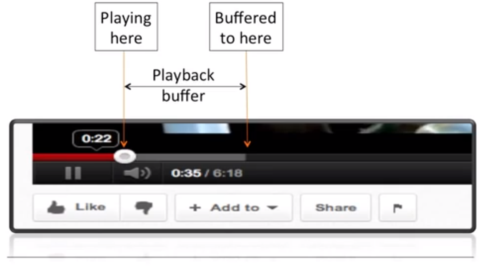
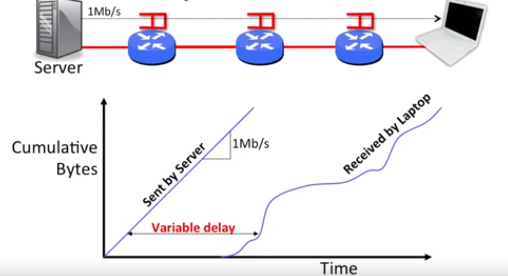
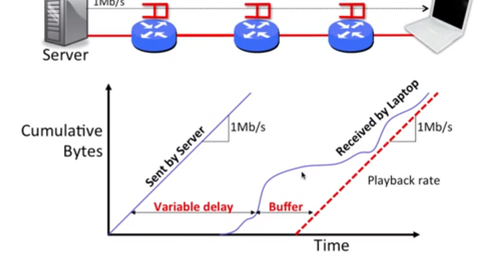

# Playback Buffer(回放缓存区)

Real-time 应用 (Youtube/Skype) 特别关心排队延迟

- 横向方向
  - Variable delay
- 纵向方向
  - 有多少 bytes 在网络中

- 横向方向
  - 这个 bytes 缓存了多长时间
- 纵向方向
  - 缓存了多少 bytes
- 如果缓存不足
  - rebuffering 重新缓存
  
## Summary
- packet switching 使得 end-to-end delay 是可变的
- 我们使用 playback buffer 来 asorb the variation
- playback buffer 可以很大，但会导致一开始缓存时间很长
- applications 预估 delay，设置 playback buffer，如果 delay 变化则 resize the buffer

