# Queue models

## 简单确定性(deterministic)队列模型
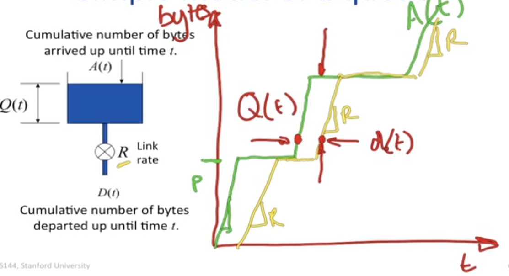
- Q(t) : 缓存量
- A(t) : 累计的 bytes
- R : link rate
- D(t): Cumulative(积累的) number of bytes departed(离开) up until time t
- d(t): time spent in the queue by a byte arriving at time t 

Q(t) =  A(t) - D(t)

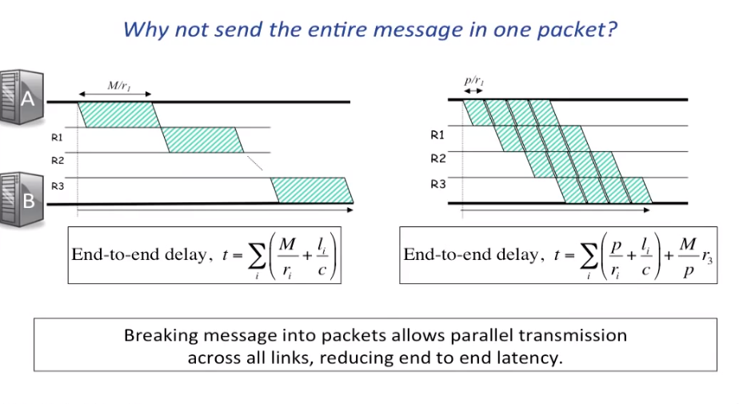
- 可以通过减少数据包的大小来降低 end-to-end delay
- 流水线效果

## Statistical(统计) Multiplexing(复用)
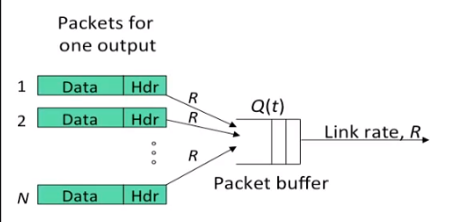
- 统计复用意味着出口链路不需要以 NR 的速率运行
- 当 aggregate rate 超过 R 时，缓冲 absorbs brief periods
- 因为缓冲区的大小有限，所以可能会发生 loss

## Summery 
- 我们常用简单确定性(deterministic)队列模型来理解 packet 在 network 中的动态情况
- 我们把 message 打包成小的 packets 因为：
  - 流水线传输
  - 减少端对端延迟
- Statistical(统计) Multiplexing(复用) 让我们高效地 carry 许多 flows 在单个 link.

## Example
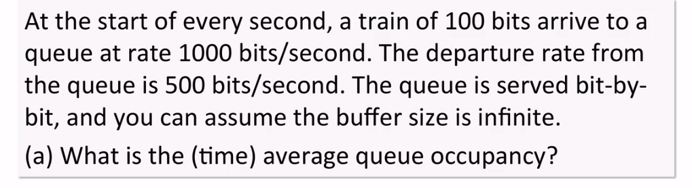

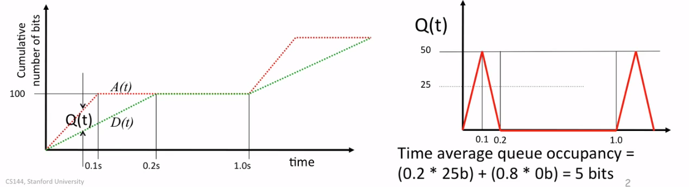

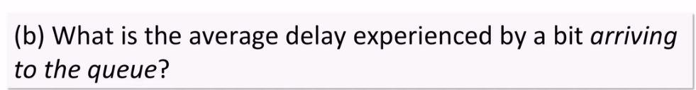

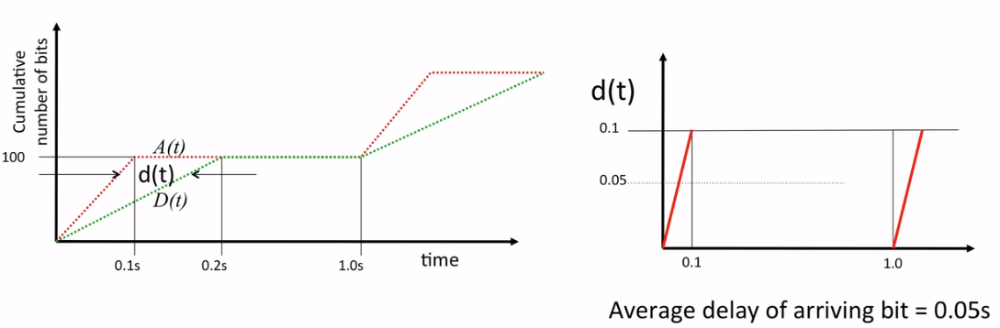

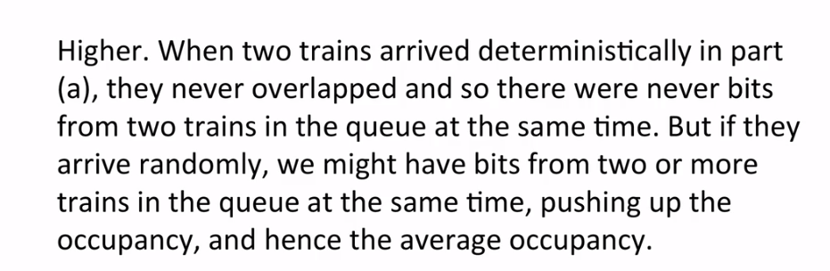
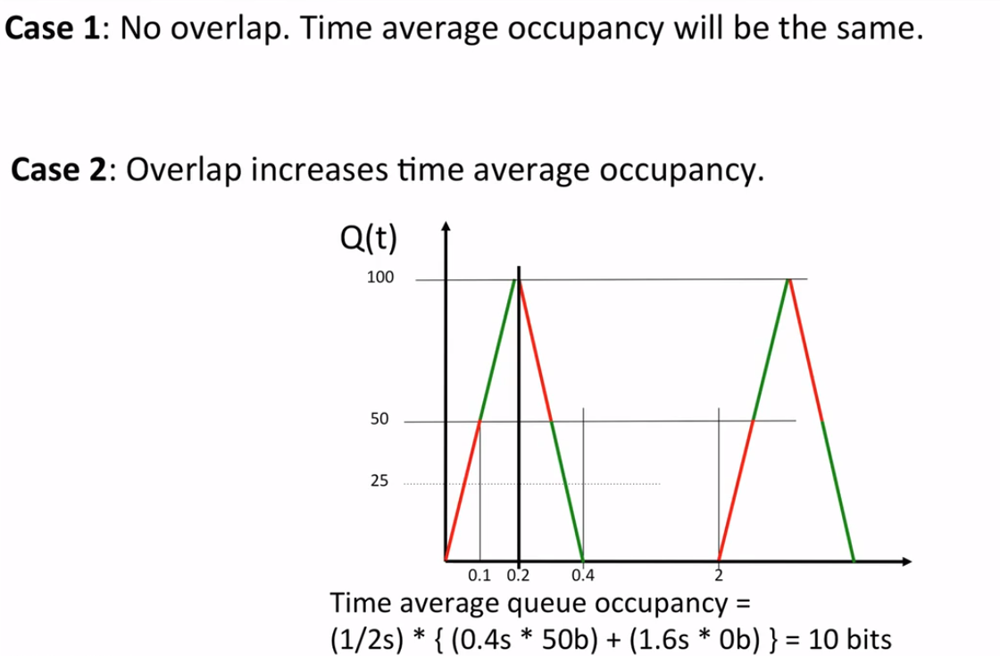

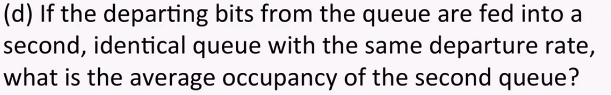
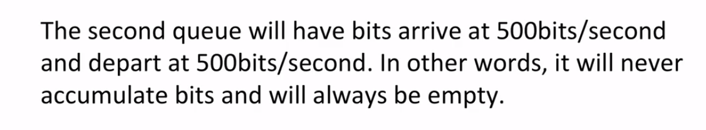
