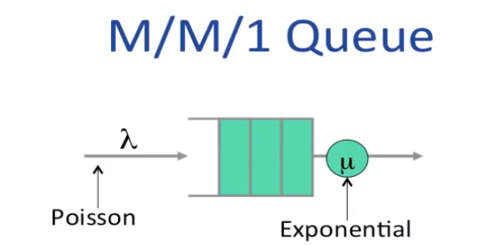

# Useful queue properties

## Queues with random arrival processes
- 到达过程很复杂，因此我们常把它认为是随机过程
- The study of Queues with random arrival processes is called **Queueing Theory**(排队论).
- 有几个有趣的属性
  - Burstiness(突发性) increases delay
  - determinism(确定性) minimizes delay
  - Little's Result(利特尔法则)
    - L = λW
      - L 队列的长度
      - λ 有效到达速率
      - W 平均延迟时间
    - 泊松过程
      - 到达情况符合泊松分布
        - 许多独立随机事件适合泊松分布(web request/ new flow arrivals)
      - 
      - E[间隔 t 时间内的到达数] = λt
      - 连续的到达时间间隔是独立的 (not bursty)
    - 注意
      - network 非常 bursty
      - packet arrivals 不是泊松分布
      - 但这个模型很适合 the arrival of new flows
  - M/M/1 Queue
  
    - d = 1/(μ-λ)
    - L = λ/(μ-λ) = k/(1-k) -> k=(λ/μ)