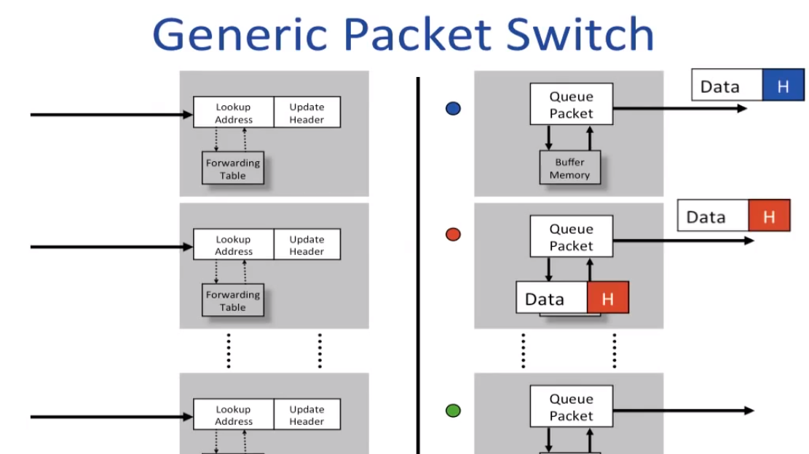
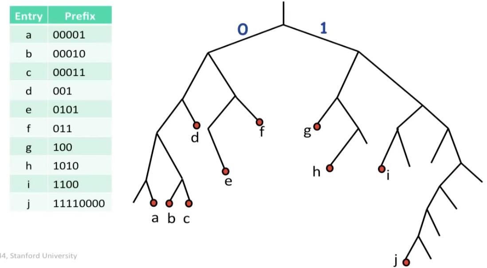
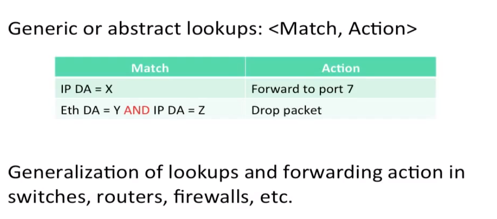

# How a packet switch work

1. packet switch look like
2. packet switch do
3. how address lookup work

## generic packet switch

### Ethernet Switch (数据链路层（第二层）)
1. 检查每个到达的 frame 的 header
2. 如果 Ethernet DA(destination address) 在 forwarding table, 把 frame forward 到 正确的 output ports.
3. 如果不在，broadcast 这个 frame 到所有的 ports(除了 frame 到达的那个 port)
4. table 中的目录通过检查到达包裹的 Ethernet SA(source address) 来更新

### Internet Router (网络层（第三层）)
1. 到达的 frame 的 Ethernet DA 是否属于这个路由器？不属于则丢弃。
2. 检查 IP 版本和 datagram 的长度
3. 减少 TTL，更新 IP header checksum
4. 检查 if TTL == 0
5. 如果 IP DA 在 forwarding table，forward the correct egress ports for next hop
6. 为下一个 hop router 找到 Ethernet DA
7. 创建一个新的 Ethernet frame 并发送它

## Lookup Address
- Ethernet addresses 
  - address 储存到哈希表
  - look for exact match in hash table
- IP addresses
  - 最长前缀匹配，不是 exact match
    - 实现方法： 
      - Binary Tire
    
      - TCAM(Ternary Content Addressable Memory 三元内容寻址存储器)
- 如今的 Loopup Address 一般这么表示

## summary
- Packet switch 包含两个基本操作
  - Lookup Address in a forwarding table
  - Switching to the correct egress(离开) port
- At a high level, Ethernet switches 和 routers 操作类似
- address lookup 在 switches 和 routers 上很不同