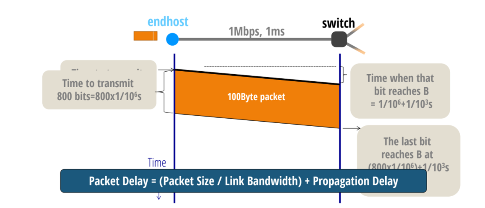
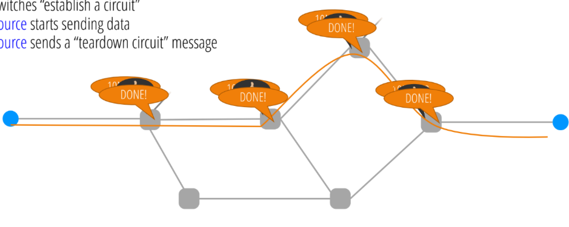
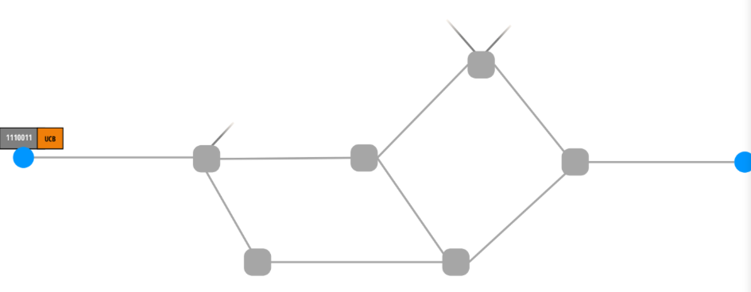

# Overview: How the Internet Works

- 数据是如何通过互联网传输的?
- 网络资源如何共享?
- 通过网络理解“life of a packet”

packets
- payload: 只对端节点有意义
- header: 对 network 和端节点
  - 一定有目标地址
- Flow :两个端点之间交换的 stream of packets

## links 的属性

- Bandwidth 带宽
  - 单位时间内发送(或接收)比特数(bits/s或bps)
  - link 的 宽
- Propagation delay 传播延迟
  - a bit 沿着链接旅行所花费的时间(秒)
  - link 的 长
- Bandwidth-Delay Product (BDP)带宽延迟乘积: (bits/time) ✖ (propagation delay (bits))
  - “capacity”(容量) of the link

## 挑战，寻址与命名
- 需要一个寻找和命名的方案
  - 名称到地址的映射
    - url 是用户级别的名称
    - 网络需要去 url 的地址
      - 必须把名称解析为主机的地址：DNS（Domain Name System）域名系统

## 挑战：路由
- 当一个包到达路由器时，由 forwarding table 决定该包发送到哪个发送链路
- Distributed routing algorithm run between switches/routers 在交换机/路由器之间运行的分布式路由算法
- 收集关于网络拓扑(topology)的信息
- 通过该拓扑的计算路径
- 在每个路由器中存储 forwarding information
- 这就是 forwarding table

## Control Plane vs Data Plane 控制平面vs数据平面
高端路由器由控制平面control plane和数据平面data plane（也称为转发平面）组成。每个平面都有自己的CPU和内存。

- 控制平面：用于计算 forwarding table 的机制
  - 固有全局(global):必须知道 topology 才能计算
  - 路由算法是控制平面的一部分
  - 时间尺度:每个网络事件 per network event
  - 挑战
    - 面对网络故障和拓扑变化
    - 计算按规模进行
    - 同时尊重互联网服务提供商(isp)的自主需求
      - 网络是由许多不同的互联网服务提供商组成
      - 他们每个人都让自己做决定：如何做他们的网络内路由
      - 他们通常不愿透露的内部决策
- 数据平面:使用这些 table 实际转发包
  - 固有本地(local):仅取决于到达的包和本地路由表
  - 转发机制是数据平面的一部分
  - 时间尺度:每个包到达 per packet arrival
  - 挑战
    - packet 到达规模大
    - 必须在极短时间内做以下内容
      - 解析包(提取地址等)
      - 在转发表中查找地址
      - 更新包报头中的其他字段(如有需要)
      - 更新相关内部计数器等。
        - 将数据包发送到适当的 output link

## 到此为止的重要话题
- 我们如何在互联网上命名终端主机?
- 我们如何到达终端主机?•
- 我们如何将名字映射到地址?•
- 如何计算转发表?
- 我们如何转发数据包?

## 统计多路复用(Statistical Multiplexing)
- 整合需求，有效共享资源
  - 与静态分区资源(statically partitioning resources)相比
- 平均流量f: A(f)
  - 一组流量的平均流量 f1, f2: A(f1+f2)
- 流量峰值速率f: P(f)
  - 流量组峰值速率 f1, f2: P(f1+f2)
- 统计多路复用意味着： 你没有为绝对最坏的情况做准备
  - 当所有事情同时达到 peek 的时候
- 您共享资源并希望峰值速率不会同时出现

## 如何分享网络资源
有两种方法
- 保留:终端主机在需要时显式保留状态
  - 请求/保留资源
  - 发送数据
  - 发布资源
  - 这种方法是通过 电路交换 circuit switching
    - 源程序向目标程序
    - 开关“建立电路”
    - 发送数据
    - 源程序发送一个“拆卸电路”消息
    
- 尽最大努力
  - 当您有数据包时就发送它们，并希望得到最好的结果……
    - 也被称为“随需应变”
    - 这种方法是通过 包交换 packet switching
    

