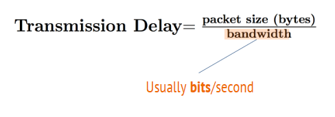
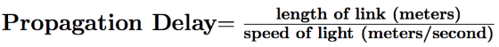
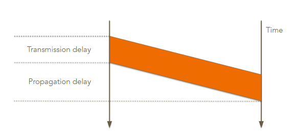
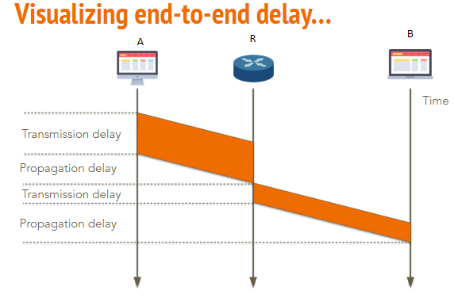
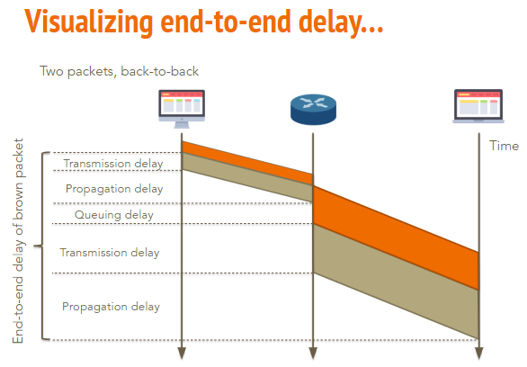
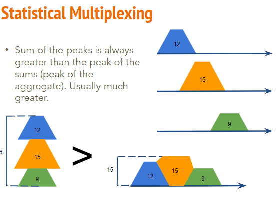

# Packets in Flight

## 延迟
- 这取决于
  - 您正在发送的数据量 和 链路速度 → **传输(transmission)延迟**  
  
    - Transmission Delay  
    
  - 您到目的地的距离 → **传播(propagation)延迟，通常是光速**  
  
  - 交通模式 → **排队(queuing)延迟**
- Bandwidth Delay Product (BDP) 时延带宽积
  - 带宽 * 传播延迟
  - 任何时候有多少 bit 在 link 上
- 端到端延迟 = 传播延迟 + 传输延迟 + 排队延迟
- Round Trip Time (RTT) 往返时间
  - RTT = 2 * (End-to-End Delay)
- packet delay  

- end-to-end delay  

- queuing delay  

## Statistical Multiplexing 统计多路复用

- 峰值的和 >> 和的峰值