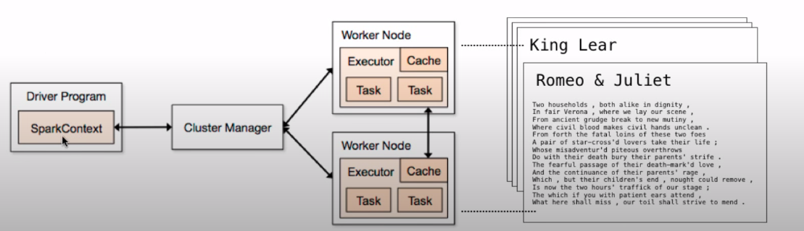
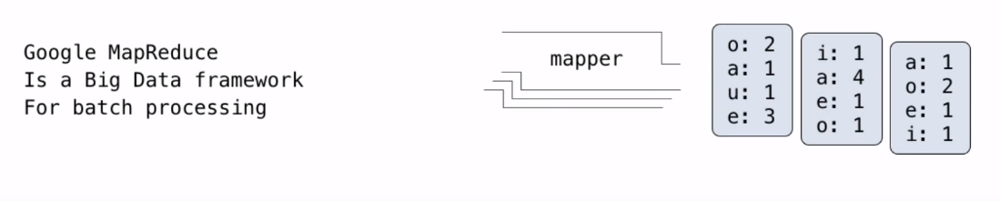
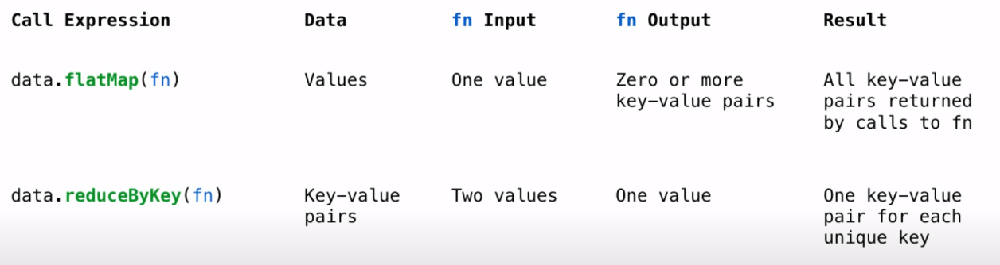

# Distributed Data 
## Computer systems
系统研究通过定义和实现抽象(abstractions)来实现应用开发。(隐藏复杂性，但保留灵活性)
- **操作系统**为不可靠、不一致的硬件提供了**一个稳定、一致的接口**。
- **网络**为不断进化的通信基础设施提供**强大的数据传输接口**
- **数据库**为复杂的软件提供了**一个声明式的接口**，可以有效地存储和检索信息。
- **分布式系统**为多台机器的集群**提供统一的接口**——有效系统的统一属性。

## Example: The Unix Operating System
Unix操作系统（及变种如Linux, Mac OS 10）的基本特征。
- 可移植性(Portability)。在不同的硬件上使用相同的操作系统
- 多任务(Multi-Tasking)。在一台机器上同时运行多个进程
- 纯文本(Plain Text)。以文本格式存储和共享数据
- 模块化(Modularity)。小型工具通过管道(pipes)灵活组成

`standard input(text input) -> process -> standard output(text output) || standard error`
- 类Unix操作系统中的标准流(standard streams)类似于Python iterators。

## python programs in a Unix environment
- `sys.stdin` 和 `sys.stdout` 的值提供了对Unix标准流文件的访问
- 一个Python文件有一个支持`iteration, read, write`方法的接口。
- 使用这些 "`files`"可以利用操作系统的文本处理抽象
- `input` 和 `print` 功能还可以从`standard input`读取和写入`standard output`。 

```python
# ex.py
import sys
for line in sys.stdin:
    sys.stdout.write(' '.join(line)) # 每个字都有空格
```

```shell script
$ python ex.py
Here it is
H e r e  i t  i s
Great
G r e a t

$ ls *.pdf | python ex.py # 所有 pdf 的 filename 都有空格
```


## Big Data
- 将 unix tools 和 写的程序结合可以给数据处理提供绝佳的环境
- 如果多个用户需要同时访问和编辑数据，可以使用数据库
- 如果想要处理的数据大小超过了一台机器的范围，就需要使用分布式数据处理

### 解决方案： Apache Spark
- Apache Spark是一个数据处理系统，它为大型数据提供了一个简单的接口。
- 弹性分布式数据集 Resilient Distributed Dataset（RDD）是 a collection of values or key-value pairs
- 支持常见的UNIX操作：`sort, distinct (uniq in UNIX), count, pipe`
- 支持常见的序列操作：`map, filter, reduce`
- 支持常见的数据库操作：`join, union, intersection`  
- 所有这些操作都可以在跨机器分区的RDD上执行。

### Apache Spark 的执行模式
  - 集中定义处理，但远程执行操作
  - 弹性分布式数据集(RDD)以分区的方式分布到工作节点上。
  - driver program 定义了RDD上的转换和操作。
  - 集群管理器(cluster manager)将任务分配给各个工作节点，让他们执行任务
  - 工作节点之间进行计算和相互交流数值。
  - 最终的结果会反馈给driver program。



### Apache Spark 的接口

- SparkContext提供了对集群管理器的访问。
```python
>>> sc	
<pyspark.context.SparkContext	...>
```
- RDD可以从文本文件来构建
```python
>>>	x = sc.textFile('shakespeare.txt')	
```
- The `sortBy` transformation(转变) and `take` 是 RDD 上的方法
```python
>>> x.sortBy(lambda s: s, False).take(2)  # 降序，给我两个元素	
['you shall ...', 'yet , a ...']
```

### Apache Spark 提供了什么
- 容错。机器或硬盘可能会崩溃
  - 群集管理器自动重新运行失败的任务
- 速度：有些机器可能会因为超载而变慢。
  - 群集管理器可以运行一个任务的多个副本，并保留先完成的那个任务的结果。
- 网络定位。数据传输很昂贵
  - 群集管理器试图在持有这些数据的机器上安排计算。 
- 监控。我的工作会在晚饭前完成吗？
  - 群集管理器提供了一个基于Web的界面描述工作
  
### MapReduce
- 一个重要的早期分布式处理系统
- 通用的应用结构，恰好可以捕获许多常见的数据处理任务。
  - 第1步(map)：输入集合中的每个元素都会产生 0 或 more 键值对 。
  - 第2步(shuffle)：将所有共享一个 key 的 键值对 聚合在一起。
  - 第3步(reduce)：将一个键的值作为一个序列(sequence)进行处理
- 早期应用：索引网页、训练语言模型和计算网页排名。

### MapReduce Evaluation Model
  - 映射阶段。将映射函数应用于所有输入，发出中间 键值对
    - 映射器为每个输入产生零或多个键值对。
    
  - Reduce phase: 对于每一个中间键，使用一个还原函数来累积与该键相关的所有值。
    - 所有具有相同 key 的 键值对 一起处理
    - 还原器产生0个或更多的值，每个值都与该中间键相关联
    



```python
def vowels(line):
    """Yield (vowel, count) pairs."""
    for v in 'aeiou':
        if v in line:
            yield (v, line.count(v))

>>> list(vowels('hello world'))
[('e', 1),('o', 2)]

>>> x = sc.textFile('shakespeare.txt')	
>>> data.flatMap(vowels).take(7)
[('a', 3), ('i', 3),('o', 4), ('u', 3), ('a', 5), ('e', 1), ('i', 2)]

>>> from poerator import add
>>> data.flatMap(vowels).reduceByKey(add).collect()
[('i', 189626), ('a', 233881), ('u', 110820),('o', 272697), ('e', 387705)]
```

​    