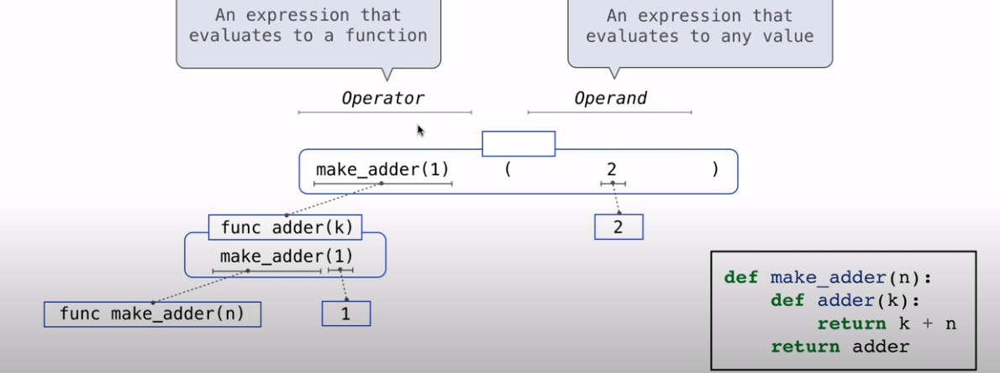
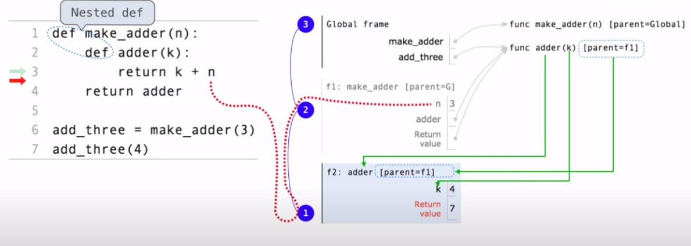

# 高阶函数

- 接受**其他函数作为参数**的函数
- 或者将**函数作为返回值**的函数

## 作为参数的函数
- 作为一般方法的函数
  - 更强大的抽象类型：
    - 一些函数表达了计算的一般方法，独立于它们调用的特定函数。
    - 命名和函数允许我们抽象而远离大量的复杂性
    - 每个通用的概念或方程都能映射为自己的小型函数
  - 缺陷
    - 全局帧会被小型函数弄乱
      - 解决方法： 嵌套函数

## 作为返回值的函数
```python
def make_adder(n):  # 用来定义这个 function
    """
    >>> add_three = make_adder(3)
    >>> add_three(4)
    7
    """
    def adder(k):  # 将要返回的 function , parent 不是 global [parent = f1] 
        return k+n
    
    return adder  # 返回的是 function

make_adder(4)(3) # 7
```




- 注意 parent 的指向
- n 在 f2 找没找到，在 f1 找找到了
- f1 一直存在

## Lambda 表达式
- 使用 Lambda 表达式凭空创建函数，它会求值为匿名函数
- 函数体具有单个返回表达式的函数
```python
square = lambda x: x * x # lambda x: x * x 求出了一个 function
square(4) # 16
(lambda x: x * x)(3) # 9


>>> def compose1(f,g):
        return lambda x: f(g(x))

#      lambda            x            :          f(g(x))
# "A function that    takes x    and returns     f(g(x))"
```

## 函数装饰器
- 将高阶函数用作执行def语句的一部分，叫做装饰器
```python
def trace1(fn):   # 接受函数 f
    def wrapped(x):
        print('-> ', fn, '(', x, ')')    # 打印地址
        return fn(x)  # 返回 f(x)
    return wrapped    # 返回 f(x)

def triple(x):
    return 3 * x

triple # tripe 方法 <function triple at 0x000001458C2EEB80/>

trace1(triple)(4)
# ->  <function triple at 0x000001458C2EEB80> ( 4 )
# 12

@trace1   # 装饰器
def another_triple(x):
    return 3 * x

another_triple # trace1 中的返回函数的方法 <function trace1.<locals>.wrapped at 0x000001458C2EED30>


another_triple(4)
# ->  <function another_triple at 0x000001458C2EEA60> ( 4 )
# 12
```
- @trace1 影响 def 的执行规则
  - triple 并没有绑定到这个函数上
  - 而是绑定到了在新定义的函数 triple 上调用 trace1 的返回函数值上。

等价关系：

```python
@trace1   # 装饰器
def another_triple(x):
    return 3 * x

# ==>

def another_triple(x):
    return 3 * x
another_triple = trace1(another_triple)

```