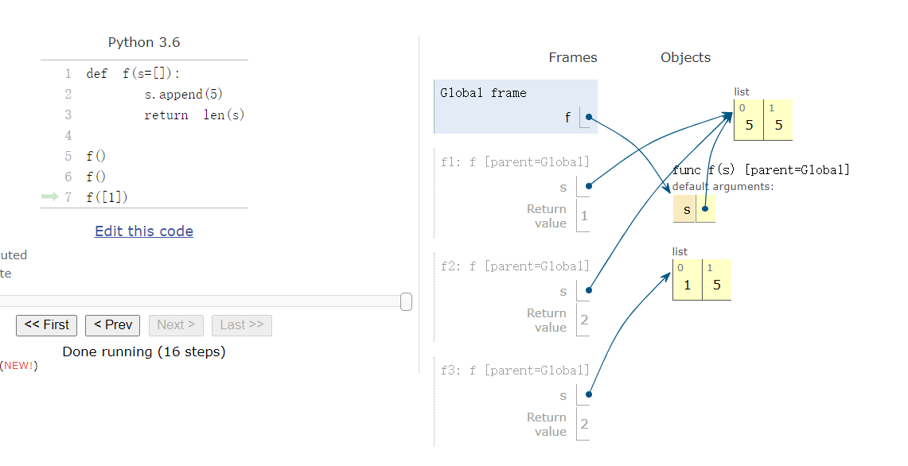

# Objects
- 对象代表着信息
- 它包含数据和行为，捆绑在一起以创建抽象
- 对象可以代表事物，但也可以代表属性、交互和过程
- 对象的类型称为类;类是 Python 中的头等值
- 面向对象的程序设计
  - 组织大型程序的比喻
  - 可以改进程序组成的特殊语法
- Python 中的每个值都是对象
  - 所有对象都有属性
  - 许多数据的处理是通过对象方法
  - 函数只做一件事情，但对象做多个事情(做每个事情都是一个函数)

## string 是 对象
- string 有属性

  
```python
s = "Hello"
s.upper()    # 'HELLO'
s.lower()    # 'hello'
s.swapcase() # 'hELLO'

a = 'A'
ord(a)       # 65  对应的 ACSII 数
hex(ord(a))  # '0x41' 是 65 对应的 16进制
```


## Object can change

- 所有引用同一对象的名称都会受到变化的邮箱
  - list & dictionaries
  
## tuples
- 不可改变的序列

  
```python
>>> (3,4) + (5,6)
(3,4,5,6)
>>> {(1,2):3}
{(1,2) : 3}
>>> {[1,2]:3}
error
```


- 他能保护 values 不被改变

  
```python
>>> turtle = (1, 2, 3)
>>> ooze()
>>> turtle
(1, 2, 3)

>>> list = [1, 2, 3]
>>> ooze()
>>> list
['Anything could be inside']
```


- 如果 tuple 内有可改变的序列，它的元素也有可能发生改变

  
```python
>>> s = ([1, 2], 3)
>>> s[0] = 4
ERROR
>>> s[0][0] = 4
([4, 2], 3)
```

## 相同与改变
- 只要我们不修改对象，一个复合对象就是它各个部分的总和
- 除了组成复合数据对象的各个部分之外，复合数据对象本身还有一个“标识”
- 即使我们改变了它的内容，复合数据对象这个“标识”还是未改变。
- 如果有两个 list 恰好有相同的内容，但他们是不同的。（复合数据对象这个“标识”不一样）

A is B  
  - 对应相同的 object 则相同 (类似 java 的 == )
  A == B

  - 对应相同的 value 则相同 (类似 java 的 equals )

    
```python
>>> [1,2] == [1,2]
True
>>> [1,2] is [1,2]
False
```


## 一些陷阱

- 默认实参值是函数的一部分，不是由调用生成的

  
```python
def f(s=[]):
    s.append(5)
    return len(s)

f()     # 1
f()     # 2
f([1])  # 2
```




