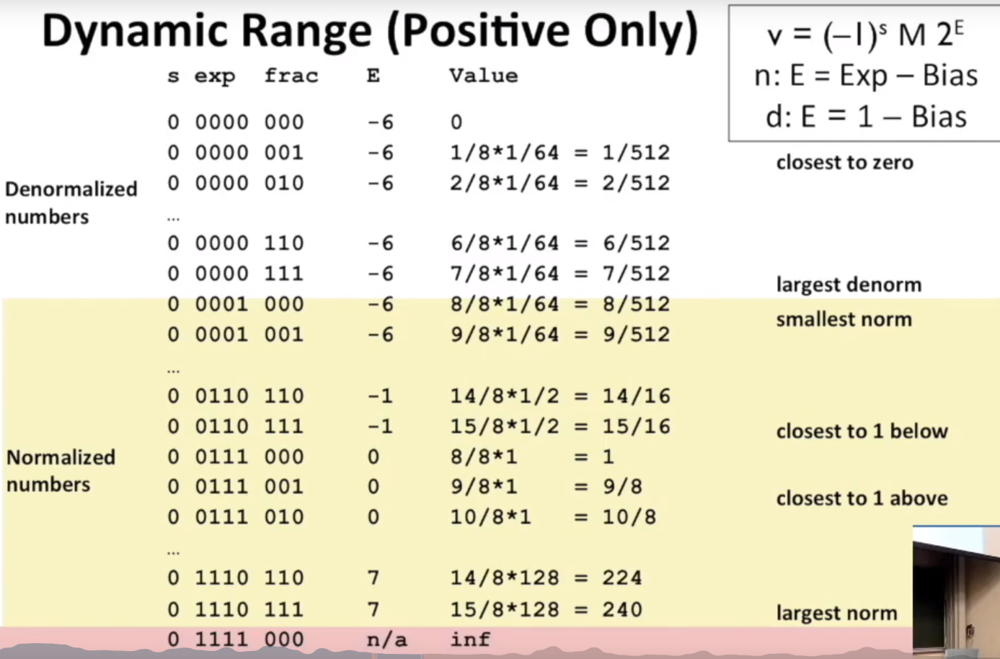
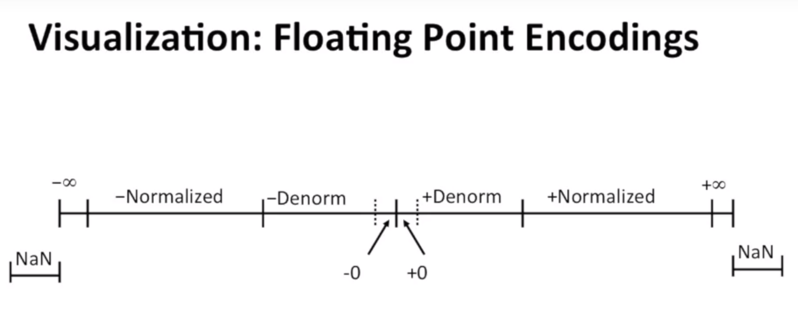

# 浮点数  
[浮点数的二进制表示方法](https://www.jianshu.com/p/f0537a661a5e)  
[IEEE 745浮点数标准](https://wenku.baidu.com/view/712a64d43186bceb19e8bbf7.html)

## 表示方式


- 对于 32 位的浮点数(float)
  - 最高的 1 位是符号位 S
  - 接着的 8 位是指数 E
  - 剩下的 23 位为有效数字 M  
    - 如果 cast float -> int, 23 的有效值用 32 位表示，因此不会丢失任何位
    - 如果 cast int -> float, 32 的有效值用 23 位表示，因此可能需要 round

- 对于 64 位的浮点数(double)
  - 最高的 1 位是符号位 S
  - 接着的 11 位是指数 E
  - 剩下的 52 位为有效数字 M
    - 如果 cast double -> int, 52 的有效值用 32 位表示，因此可能需要 round
    - 如果 cast int -> double, 32 的有效值用 52 位表示，因此不会丢失任何位

### 练习
```c
int x = ...;
float f = ...;
double d = ...;
 
x == (int)(float) x    // false
x == (int)(double) x   // true
f == (float)(double) f // true
f == (double)(float) f // false
f == -(-f)             // true
2/3 == 2/3.0           // false 2/3 = 0 , 2/3.0 是浮点数
d < 0.0 => d*2 < 0.0   // **true** 溢出到负无穷大也是 < 0.0
d > f => -d < -f       // true 
d * d >= 0             // true
(d + f) - d == f       // false

```


## M 、 E 的取值规则
- M
  - 1 ≤ M < 2
    - M可以写成 1.xxxxxx 的形式，其中 xxxxxx 表示小数部分
    - 在计算机内部保存 M 时，默认这个数的第一位总是 1，因此可以被舍去，只保存后面的 xxxxxx 部分
      - 保存 1.01 的时候，只保存 01。读取的时候，再把第一位的 1 加上去
- E
  - 无符号整数（unsigned int）
    - Exp 为 8 位，它的取值范围为 0~255
    - E 为 11 位，它的取值范围为 0~2047
  - Exp 的三种情况
    1.规格化
      - Exp 不全为 0 或不全为1 （规格化形式 normalized values,需要在有效数字 M 前加1）
        - 指数 Exp 的计算值减去127（或1023），得到真实值
          - 科学计数法中的 Exp 是可以出现负数的，Exp 的真实值必须再减去一个中间数
              - 对于 8 位的 Exp，这个中间数是 127；对于 11 位的Exp，这个中间数是 1023
    2. 非规格化  
      - Exp 全为 0 （未规格化形式 Denormalized values，有效数字 M 不再加上第一位的 1）
        - 用于表示 ±0，以及接近于 0 的数字
        - 指数取值: 1-127
          - 这是为了平滑设计,需要考虑下最小的规格化数字  
          
    3. 特殊情况
      - Exp 全为 1
        - 有效数字 M 全为 0，表示 ±无穷大（正负取决于符号位 S）
        - 有效数字 M 不全为 0，表示这个数不是一个数（NaN）




## 浮点数的一些特殊性质
- 0 和 Integer 相同
- 浮点数间相互比较很方便，非规格化 小于 规格化，规格化 小于 特殊情况（无穷）   
  - 必须先比较符号位
  - 必须考虑 -0 = 0
  - 不能考虑 NaN (比其他任何数包括无穷大都要大)

## 浮点数的 round 方法
IEEE标准列出4种不同的方法：
- 朝+∞ 方向舍入：会将结果朝正无限大的方向舍入。
- 朝 -∞ 方向舍入： 会将结果朝负无限大的方向舍入。
- 朝 0 方向舍入： 会将结果朝0的方向舍入。
- 舍入到最接近的数，如果刚好为5则舍入最接近的偶数。
  - 默认方法，其他方法必须使用寄存器
  - 符合统计学原理
  - Round(0.5) = 0; Round(1.5) = 2
  
### 二进制数的 round 方法
- 偶数： 最后一位是 0
- 中间数: 需要 round 的位置是 1000.. 这种

round 1/32 to nearest 1/4
2 3/32 -> 10.00 011 -> 10.00 -> 2       # 011 < 1/2
2 3/16 -> 10.00 110 -> 10.01 -> 2 1/4   # 110 > 1/2
2 7/8 -> 10.11 100 -> 11.00 -> 3        # 100 = 1/2 向偶数 round, 要使得最后一位等于 0
2 5/8 -> 10.10 100 -> 10.10 -> 2 1/2    # 100 = 1/2 向偶数 round, 要使得最后一位等于 0

## 浮点数操作
### 乘法
(-1)s2 M1 2E1 X (-1)s2 M2 2E2
- 先计算   
  - 符号位取亦或 s1 ^ s2
  - M 相乘
  - E 相加 (是指数)
- fixing
  - 如果 M >= 2，右移 M，E+1
  - 如果 E 超出范围，溢出
  - 对 M 取 Round,使其符合 frac 的精度
- 因为过程中有可能出现 inf(inf 任何操作都是 inf)，因此不具有结合律
  - (1e20\*1e20)\*1e-20 = inf,1e20\*(1e20\*1e-20) = 1e20

###加法
(-1)s2 M1 2E1 + (-1)s2 M2 2E2  
假设 E1 > E2
- 先计算
  - 对阶：比较两个浮点数的阶码值的大小，使两个数取相同的阶码值
    - 阶码小的数的尾数右移,每移一次阶码+1 (舍弃了精度)
  - 实现尾数的加(减)运算
- fixing
  - 如果 M >= 2, 右移 M，E+1
  - 如果 M < 1, 左移 M，E-1
  - 如果 E 超出范围，溢出
  - 对 M 取 Round,使其符合 frac 的精度
- 因为在过程中根据具体数舍弃了精度，因此不具有结合律
  - (3.14+1e10)-1e10 = 0, 3.14+(1e10-1e10) = 0
    
## 总结
- 浮点数有清楚的数学性质
- 以 M × 2^E 的方式表示数字
- 可以推断出操作
- 和实际运算不完全一致
  - 不满足结合律和分配律

## 举例：
### 0x41D56A8CDDC00000怎样被表示成了浮点数1437217655.00000？

0x41D56A8CDDC00000

= 0  10000011101  0101011010101000110011011101110000000000000000000000

1. S=0，为正数

2. E=(10000011101)-1023=1053-1023=30

3. M=1. 0101011010101000110011011101110000000000000000000000

所以，其大小为1. 0101011010101000110011011101110000000000000000000000*2^30

=1010101101010100011001101110111.0000000000000000000000

=1437217655.0

### 例2：已知整数1092857364，它对应的32位浮点数是？
    
1. 整数1092857364转换为二进制1000001001000111010111000010100，数数只有31位，我们在前面加1位0，即为01000001001000111010111000010100
2. 按照32位的浮点数表示方法，拆成0 10000010 01000111010111000010100
3. 由于符号位为0，则为整数。
4. E=130-127=3。
5. M=01000111010111000010100，则其真实尾数为1. 01000111010111000010100。
6. 所以其大小为1. 01000111010111000010100*2^3，将小数点右移3位，得到1010. 001110101110000101。
7. 而1010的十进制为10。
8. 0. 001110101110000101的十进制为1*2^(-3)+1*2^(-4) + 1*2^(-5) + 1*2^(-7) + 1*2^(-9) + 1*2^(-10) + 1*2^(-11) + 1*2^(-16) +1*2^(-18)=0.23。
9. 所以其大小为10.23。
    
### 例3：假设已知32位浮点数10.23，它对应的整数是？
1. 10.23的二进制表示为1010. 001110101110000101。
2. 由于规定尾数的整数部分恒为1，则表示为1.010001110101110000101*2^3
3. E=3，加上127为130，表示为10000010
4. 对于尾数将整数部分的1去掉，为010001110101110000101，在其后面补0使其位数达到23位，则为01000111010111000010100
5. 则其二进制表示形式为 0  10000010 01000111010111000010100
6. 即为10进制整数1092857364。
 