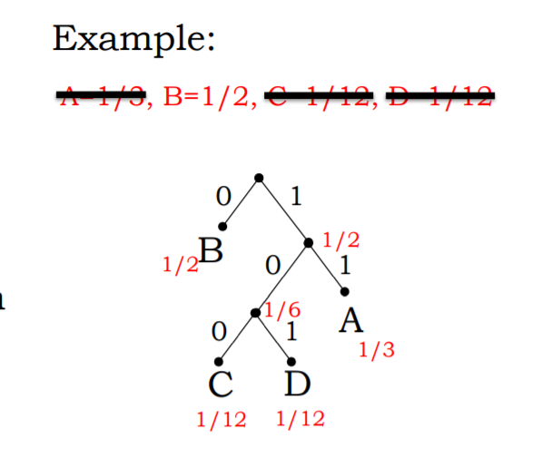

# 6.004.1x
1. 数字电路
2. 计算机体系结构
3. 计算机组织

## 数字电路
- 用电信号编码信息
- 设计逻辑门
  - 晶体管开关电路，可以简单操作编码信息
- 构建存储信息的内存组件
  - 执行计算序列的电路
- 构建任何数字系统所需的组件

## jade
https://computationstructures.org/exercises/sandboxes/jade.html

## 信息
- Data communicated or received that resolves uncertainty about a particular fact or circumstance. (传达或接收的数据，以解决某一特定事实或情况的不确定性。)
- 不确定性测量
  - `I(Xi)=log2(1/Pi)`
    - 这样子可以用二进制形式表示
    - `I(Xi)` 越高表示的信息越多，不确定性越低
- 平均信息量(熵)
  - `H(X) = E(I(X)) = sum(Pi * I(Xi))`
  - 是我们需要传输的信息的下限
    - 低于这个信息，工作会失败
    - 高于这个信息，不能最高效利用我们的资源
    - 平均发送精确的 `H(X)`,会获得完美的编码

## encodings
位字符串与要编码的数据集间的明确映射
- 固定长度编码 
  - `00 -> A` , `01 -> B`
  - `ABBA` -> `00-01-01-00`
- 可变长度编码
  - 使用不同长度的位表示编码符号
  - `01 -> A` , `1 -> B`, `11 -> C`
  - `ABBA` -> `01-1-1-01`
  - 会出现无法解码的问题，反推无唯一解
  - 解决方法：
    - 使用二叉树 encoding, 符号是 leaves, 0 为左侧，1 为右侧

## 固定长度编码
- 所有 leaves 都有相同的 depth
  - 支持随机访问
    - 想确定编码的第三个符号，可以跳过前两个符号
  - `H(X) = E(I(X)) = sum(Pi * I(Xi))`, `Pi = 1/N`
  - `H(X) = sum((1/N) * log2(1/(1/N))) = sum(1/N)log2(N)) = log2(N)`
  - 例子：数字
    - 十进制数字（10 个数字），关联的熵是 `log2(10) = 3.322`
    - 1000 位十进制数字需要 4000 位来表示，这是效率低下的，其实 3400 位就可以了。
  - 例子：ASCII 
    - 94 个打印字符，关联的熵是 `log2(94) = 6.555`

### 二进制补码
- 最大的负数：`0b10000`
- 最大的正数：`0b01111`
- -1: `0b11111`
- -1 + 1 = `0b11111+0b00001` = `0b00000` = `0`
- `A+(-A)=0=-1+1` => `-A = (-1 - A) + 1` => `-A = ~A + 1`
  - `-1 - A` = `0b11111 - A` = `~A` 

## 变长编码
- 如果每个元素出现的概率不同，则使用变长编码形式
- 理想情况下，Xi 的预期编码长度与 H(X) 匹配，H(X) 是预期信息内容
  - Xi 概率越大，H(X) 越小，使用更短的编码

|choice|p|encoding|
|:--:|:--:|:--:|
|"A"|1/3|11|
|"B"|1/2|0|
|"C"|1/12|100|
|"D"|1/12|101|
`H（X）= (2)(1/3) + (1)(1/2) + (3)(1/12) + (3)(1/12) = 1.667 bits`

1000 个 symbol:
- 定长编码 = 2000 bits
- 变长编码 = 1667 bits
- 长度下限 = 1626 bits

## 霍夫曼算法
- 如何构建最佳可变长度编码
  - 首先选择概率最小的两个符号/子树，形成一个二叉树，这个二叉树父节点的概率是这两个符号之和，
  - 在符号列表中删除这两个元素
  - 子树加入符号列表
  - 以此类推，递归形成一棵二叉树

### 能否继续压缩？
- 可以通过成对符号，而不是单个符号进行进一步压缩
- 现代压缩算法自适应哪些序列频繁出现，从而实现短编码
  - 例如：自然语言数据
  - 压缩可以大大减少原始文件的大小

## 如果发生错误？
- 汉明距离
  - 相同长度编码，相同位置数字不同的个数
- 添加一个校验和来生成所需的集合
- 最简单的错误检测码：奇偶校验和
  - 偶检验和
    - 添加一位使得1的个数位偶数
    - 如果1的个数位奇数则错误
  - 要检测 E 个错误，需要最小汉明距离为 E + 1
  - 要纠正 E 个错误，需要最小汉明距离为 2E+1 

  