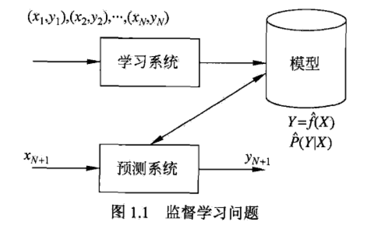

# 统计学习

特点
- 基于数据构建概率统计模型，并用模型对数据进行预测
- 以数据为研究对象
- 目的是为了分析和预测数据

三要素
- 模型、策略、算法

数据的基本假设
- 同类数据具有一定的统计规律性

## 监督学习
任务
- 学习一个模型，使其对任意给定的输入，对其相应的输出做一个好的预测

方法
1. 给定有限的训练数据，数据是独立同分布尝试的；
2. 假设要学习的模型属于某个函数的集合（假设空间）
3. 应用某个评价准则，从假设空间中选取一个最优模型，使它对已知训练数据及未知测试数据在给定的评价准则下有最优预测
4. 最优模型由算法选取

### 基本概念

输入空间和输出空间
- 输入和输出的所有可能取值

特征空间
- 每个具体的输入是一个实例，用特征向量来表示
- 所有特性向量存在的空间为特征空间
- 特征空间的每一维对应于一个特征

三类不同的问题
- 回归问题
  - 输入输出均为连续变量
- 分类问题
  - 输出变量取有限个离散值
  - k近邻法、感知机、朴素贝叶斯法、决策树、逻辑回归、支持向量机、贝叶斯网络
- 标注问题
  - 输出是一个向量，向量的每个值属于一种标记类型
  - 隐马尔可夫模型、条件随机场

## 三要素

### 模型
模型假设索要学习的条件概率分布或决策函数
- 模型的假设空间 F 包含所有可能的条件概率分布或决策函数
  - `F = {f(Y = f(X))}`

### 策略
从假设空间中选取最优模型

损失函数
- 用一个方法来度量错误的程度
  - 0-1损失函数
  - 平方损失函数 （最小二乘法）
  - 绝对损失函数 `L(Y,f(X)) = | Y - f(X) |`
  - 对数损失函数 `L(Y,P(Y|X)) = -logP(Y|X)`
  
选择风险函数期望最小的模型，然而期望风险需要联合分布 P(X|Y)，因此选择经验风险，当样本容量趋向于无穷，经验风险趋向于期望风险
- 经验风险 `Rexp(f) = sum(L(yi,f(xi)))/N`

经验风险最小化
- 经验风险最小化认为当经验风险的值最小时，模型最优 （模型是条件概率分布，损失函数是对数损失函数，这就是极大似然估计）
- 但经验风险最小化在样本量过小时，会有过拟合现象，因此提出结构风险最小化

结构风险最小化
- 经验风险上加一个罚项，用于描述模型复杂度（例如模型的参数个数、多项式的次数）
- `Rsrm(f) = sum(L(yi,f(xi)))/N + λJ（f)`
- λ 用于权衡经验风险和模型复杂度，λ >= 0
- J(f) 模型越复杂越大

至此，监督学习问题变成了最优化问题
### 算法
监督学习问题变成了最优化问题，求解最优模型

## 过拟合
一味地追求提高对训练数据的预测能力，使得所选模型复杂度比真模型更高
- 所包含的参数过多
- 会导致对已知数据预测效果很好，未知数据预测效果很差

## 模型选择方法
正则化和交叉验证

### 正则化
- 经验风险上加个正则项 `λJ（f)`
- 一般是模型复杂度的单调递增函数
- 模型越复杂，正则化值越大
- `min( sum(L(yi,f(xi)))/N + λJ（f) )`

### 交叉验证
- 分为三部分，测试集、验证集、训练集
- 训练集用于训练模型，验证集用于选择模型，测试集用于最终方法的评估

基本想法
- 重复利用数据
- 反复切分、测试、模型选择

#### S折交叉验证
- 随机切分为S个互不相交的大小相同的子集，利用 S-1 个子集的数据训练模型，余下的子集测试模型
- 将这一过程对可能的S种选择重复进行（反复调整余下的子集），最后选出S次测评中平均测试误差最小的模型
- 当 S = N（数据集容量） 时，又称为留一交叉验证（每次只测试 1 个值）

## 生成方法与判别方法

### 生成方法
由数据学到联合概率分布P(X|Y)，然后求出条件概率分布作为预测模型
- `P(Y|X) = P(X,Y)/P(X)`
- 模型表示给定 X 产生 Y 的生成关系
- 典型应用：朴素贝叶斯法、隐马尔可夫模型
### 判别方法
直接学习决策函数f(X)和条件概率分布P(Y|X)作为预测的模型，即判别模型
- 关心的是对给定 X 生成什么样的 Y
- 典型应用：k近邻法、感知机、决策树、逻辑回归、支持向量机、条件随机场

### 两者的区别举例
判别式模型举例
- 要确定一个羊是山羊还是绵羊，用判别模型的方法是从历史数据中学习到模型，然后通过提取这只羊的特征来预测出这只羊是山羊的概率，是绵羊的概率。

生成式模型举例
- 利用生成模型是根据山羊的特征首先学习出一个山羊的模型，然后根据绵羊的特征学习出一个绵羊的模型，然后从这只羊中提取特征，放到山羊模型中看概率是多少，在放到绵羊模型中看概率是多少，哪个大就是哪个。

区别
- 判别式模型是根据羊的特征可以直接给出这只羊的概率
- 生成式模型是要都试一试，选“生成”概率最大的那个