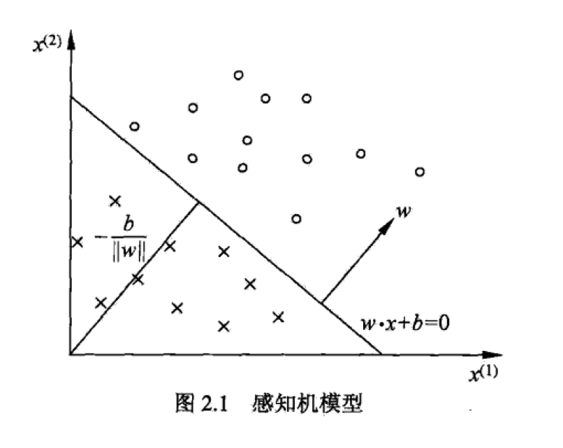
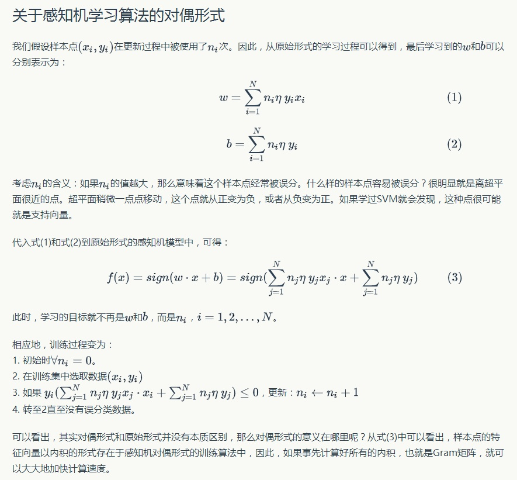

# 感知机
二类分类的线性分类模型
- 输入特征向量，输出 1 或 -1
- 感知机学习旨在求出将训练数据进行线性划分的分离超平面
- 是判别模型

## 定义
`f(x) = sign(w·x + b)` 
- `w,b 是感知机模型参数`
- w 权值向量
- b 偏置
- w·x 是 w 和 x 的内积

对应特征空间的一个超平面S，w 是超平面的法向量，b是超平面的截距，这个超平面把特征空间划分为两个部分

## 学习策略

### 数据集的线性可分性
如果可以数据集的正实例点和负实例点完全正确低划分到超平面的两侧，对 y = +1 由 w·x + b > 0,对 y = -1 由 w·x + b < 0,
则称这个数据集是线性可分数据集

### 学习策略
定义损失函数
- 误分类点到超平面的总距离
- 误分类点的 -yi(w·xi+b) 总是大于0
- `L（w,b) = - 误分类点sum(yi(w·xi+b))`
- L(w,b) 是w,b的连续可导函数
### 算法
随机梯度下降法
- 任选一个超平面 w0,b0
- 随机梯度下降法不断极小化损失函数
  - 一次随机取一个误分类点使其梯度下降
- w <- w+ηyixi (对 w 求偏导)
- b <- b+ηyi   (对 b 求偏导)
- η 为学习率

### 特点
- 当训练集线性可分，算法是收敛的
- 存在许多解，依赖于初值的选择
- 当训练集线性不可分，感知机学习算法不收敛，迭代会发生震荡

## 对偶形式
可以加速计算

