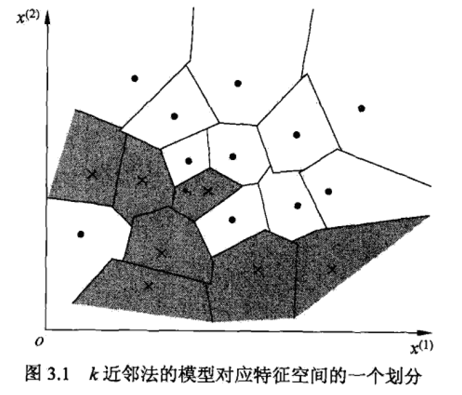

# k近邻法
用于分类与回归，本内容只讨论分类

分类时，对新的实例，根据 k 个最近邻的训练实例的类别，通过分类决策（如多数表决）预测

不具有显式的学习过程，实际上是利用训练集对特征向量空间进行划分

## 三个基本要素
距离度量（如欧式距离）、k 值的选择、分类决策规则（如多数表决）

### 模型
对于每个训练实例点 xi, 距离该点比其他点更近的所有点组成一个区域，叫做**单元**
- 每个训练实例点拥有一个单元
- 单元构成特征空间的划分
- 最近邻法将实例xi的类yi作为该单元中所有点的类标记
- 每个单元的类是固定的

### 距离度量
欧氏距离
- 两点的自然长度

## k 值的选择
过小
- 邻域较小。近似误差减小，估计误差增大
- 模型过于复杂，容易发生过拟合

过大
- 邻域较大。近似误差增大，估计误差减小
- 模型过于简单，忽略了大量有用信息

选取方法
- 先取一个比较小的值，再通过交叉验证法选取最优 k 值

## 分类决策规则
多数表决
- k 个邻近训练实例的多数类决定输入实例的类

## 实现
使用 kd 树搜索邻近点

